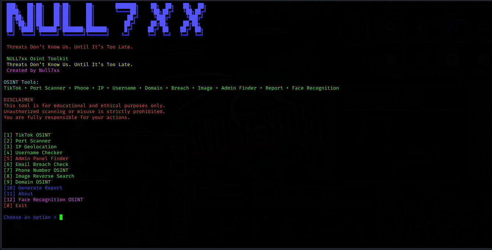

<div align="center">

<br><br>

# Null7xx OSINT Toolkit

**Threats Don’t Know Us. Until It’s Too Late.**

Advanced, fast, OSINT toolkit built in Python 

<br>

<br><br>

### Features
- TikTok Profile Analyzer
- Advanced Port Scanner
- Phone Number OSINT 
- IP Geolocation
- Username Checker 
- Admin Panel Finder 
- Email Breach Check
- Image Reverse Search
- Domain OSINT
- Custom Report Generation
- Face Recognition OSINT

<br>

### Installation & Run (Linux / Kali / PC)
```bash
git clone https://github.com/null7xx/osint
cd osint
pip install -r requirements.txt
python3 Null7xxOsint.py
```


## Face Recognition Setup
Create a folder named known in the tool directory
Add clear front-face photos (filename = person name, e.g. null7xx.jpg)
Tool will match target images against this database
Unknown faces auto-save in unknown_faces/ folder

### Results
*All results automatically saved in results/ folder*

Need Help?
DM me on Telegram:
👉 t.me/nullx7x
GitHub: github.com/null7xx
TikTok: @null7xx


DISCLAIMER: Educational & ethical use only.
Unauthorized scanning or misuse is prohibited.
You are responsible for your actions.


Made with ❤️ by Null7xx | Cyber Alpha
